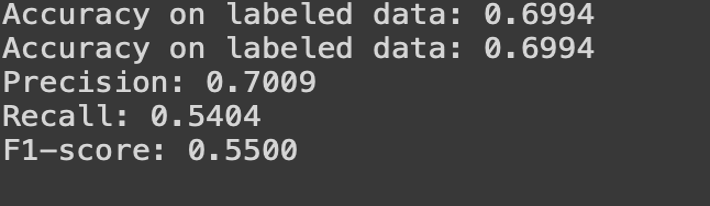

Project Name
Exploring Semi-Supervised learning on California Housing Dataset

Student Name: Tejas Mhadgut

RIT Email ID: tm3886@rit.edu

Course: DSCI 633: Foundations of Data Science
 Instructor: Dr. Nidhi Rastogi
Date: 15 December 2023

Data Science Problem

The project focuses on exploring self-training, an example of semi-supervised learning technique using the California Housing Dataset. 
The primary objectives of this project are:
Transform the dataset from a regression problem into a classification problem.
Remove certain number of labels from the dataset to make it suitable for demonstrating semi-supervised technique.
Perform semi supervised learning using various models and evaluate their performances to see which model suits the best.
These objectives will be explained in detail further in the report.
Dataset and Data Exploration
Let’s Explore the California housing dataset,
This dataset was obtained from the StatLib repository. https://www.dcc.fc.up.pt/~ltorgo/Regression/cal_housing.html
We will be importing this dataset using sklearn library.
The Characteristics of this dataset are as follows:
Number of Instances: 20640
Number of Attributes: 8 numeric, predictive attributes and the target
Attribute Information:
- MedInc           median income in block group
- HouseAge       median house age in block group
- AveRooms      average number of rooms per household
- AveBedrms     average number of bedrooms per household
- Population      block group population
- AveOccup       average number of household members
- Latitude          block group latitude
- Longitude       block group longitude
Missing Attribute Values: None
The target variable is the median house value for California districts, expressed in hundreds of thousands of dollars ($100,000).
This dataset was derived from the 1990 U.S. census, using one row per census block group. A block group is the smallest geographical unit for which the U.S. Census Bureau publishes sample data (a block group typically has a population of 600 to 3,000 people).
A household is a group of people residing within a home. Since the average number of rooms and bedrooms in this dataset are provided per household, these columns may take surprisingly large values for block groups with few households and many empty houses, such as vacation resorts.

The target variable being median house value which is a continuous variable it is evident that the given problem here is a regression problem. But we will be converting this target variable into a categorical discreet variable. The rationale behind doing so is as follows
Classification labels are often propagated more easily across similar instances in semi-supervised learning. Discrete labels might propagate more consistently and effectively in certain semi-supervised algorithms compared to continuous predictions.
Classification problems can sometimes lead to simpler decision boundaries compared to regression problems. In semi-supervised learning, simpler decision boundaries can be advantageous as they may generalize better to unlabeled data.
Certain semi-supervised learning algorithms or techniques might be more naturally suited for classification tasks. Transforming the problem into a classification format can make it easier to apply specific algorithms designed or adapted for semi-supervised learning.
The discrete nature of class labels might sometimes offer more stable and interpretable predictions in semi-supervised settings, especially when using techniques like self-training or co-training.
If there's a lack of labeled data points for continuous target values, leveraging unlabeled data might be less straightforward compared to classification tasks.
Often deals with discrete categories or classes, which might be easier to identify and assign to data instances, making it more amenable to semi-supervised techniques in certain scenarios.

The reason I want to explore semi-supervised learning approach is because it is much more practical in the real world as compared to supervised learning.
In many domains, obtaining labeled data can be challenging due to factors like privacy concerns, expert knowledge requirements, or rare events. Semi-supervised learning makes the most out of limited labeled data by utilizing additional information from the larger pool of unlabeled data.
Semi-supervised learning models can be updated or expanded more easily with new unlabeled data, enabling continuous learning and scalability in dynamic real-world environments.

To achieve all of our objectives
We encoded the MedHouseValue target variable into four bins 0.0, 1.5, 3.0, 4.5 and labeled them as 1, 2, 3, 4. Successfully converting the problem into classification.
We split the data into train and test subsets using StratifiedShuffleSplit to make sure all the classes are represented proportionally in the training dataset as the whole data set.

Now we perform exploratory data Analysis on the dataset.

As we can see in the above figure there is quite a bit of difference between 75% and max values in the above fields. This can be considered as outliers but for this dataset it can be rare but valid to have data points with large number of Average rooms, Average Bedrooms, Average Occupation and Average Population as this California housing dataset presents state of the housing prices and it is normal to see minority of wealthy people.

Scatter plot

Above is a scatter plot of data points. The dark red points are people living closer to the ocean proximity, hence having most expensive housing.

Model implementations
After train and test split, and exploratory data analysis, we move on to model implementations.
We Perform Standard Scaling on the training data and transform the training and testing data.
Scaling helps to bring all features to a similar scale, preventing one feature from dominating others solely due to its larger magnitude. It ensures that each feature contributes proportionately to the model training process.
Then we remove 70% of labels from the y_train variable by replacing it with -1 as sklearn selftrainingclassifier considers it as unlabled data. This step allows us to approach our self training problem.
The SelfTrainingClassifier is a sklearn classifier used in semi-supervised learning, where a classifier is initially trained on a small set of labeled data and then proceeds to iteratively label the unlabeled data points with high confidence predictions. It keeps adding these pseudo-labeled data points to the labeled set, refining its predictions, and potentially improving the model's performance.
# Trains logistic model for semi-supervised problem
self_training_clf = SelfTrainingClassifier(logistic)
self_training_clf.fit(X_train_scaled, y_labeled)

The models used are as follows:
Logistic Regression 
SVM
Random Forest
Decision Tree

Logistic Regression: 
Logistic Regression is a simple yet effective classification algorithm that serves as a good starting point or baseline model in many machine learning projects.
When dealing with limited labeled data, Logistic Regression can still perform reasonably well.
We Put pentalty as l1 and l2 to see how model performs under regularization
Performed GridSearchCV for hyperparameter tuning. Below are the various hyperparameters used
{'C': [0.1, 1, 10, 100],'max_iter': [3000, 4000, 5000]}
We perfomed l1and l2 Logistic regression with and without PCA

SVM:
SVMs can use different kernel functions (e.g., linear, polynomial, radial basis function - RBF) to handle complex relationships between features. The code explores SVMs with various kernel functions to understand their impact on classification performance.
SVMs aim to maximize the margin between classes, leading to better generalization and potentially lower generalization error on unseen data.
For this project hyperparameter tuning is out of scope as it took extensive amount of time
Perofmed SVM both before and after PCA

Random Forest:
Random Forests tend to be less prone to overfitting, especially when compared to single decision trees. By aggregating predictions from multiple trees, Random Forests can generalize well to new, unseen data.\
Performed GridSearchCV for hyperparameter tuning. Below are the various hyperparameters used
param_grid = {'n_estimators': [50, 100, 150],'max_depth': [None, 5, 10, 15]}
Performed Random Forest before and after PCA

Decision Tree:
Decision Trees can model non-linear relationships between features and the target variable. They can segment the feature space into regions, making them effective for complex classification tasks.
Similar to other classifiers like Logistic Regression, SVMs, and Random Forests, Decision Trees were used within the SelfTrainingClassifier to explore their behavior in semi-supervised learning. Decision Trees are simple and suitable candidates to observe how they adapt with additional pseudo-labeled data during the self-training process.
Performed GridSearchCV for hyperparameter tuning. Below are the various hyperparameters used.
param_grid = {'max_depth':[3,5,7,10,15]        'min_samples_leaf':[3,5,10,15,20],
'min_samples_split':[8,10,12,18,20,16],
'criterion':['gini','entropy']}
Performed Random Forest before and after PCA.

Model Evaluation

Precision: Out of all the positive predictions we made, how many were true?
Recall: Out of all the data points that should be predicted as true, how many did we correctly predict as true?
F1 Score: F1 Score is a measure that combines recall and precision. As we have seen there is a trade-off between precision and recall, F1 can therefore be used to measure how effectively our models make that trade-off.

Logistic Regression l1 without PCA
Evaluation: 

Confusion Metrics:

Logistic Regression l2 without PCA
Evaluation:

Confusion Matrics:

Logistic Regression l2 with PCA

Confusion Metrics:

Logistic Regression l1 with PCA:

Confusion Metrics:

SVM rbf kernel without PCA:

Confusion Metrics:

SVM rbf kernel with PCA:

Confusion Metrics:

SVM linear without PCA:

confusion metrics:

SVM linear kernel with PCA:

Confusion metrics:

Random Forest without PCA:

Confusion metrics:

Random Forest with PCA:

Confusion Metrics:

Decision Tree without PCA:

Confusion Metrics:

Decision Tree with PCA:

Confusion Metrics:

Let's summarize the key evaluation metrics for each model:
Logistic Regression l1 without PCA: Moderate performance across metrics.
Logistic Regression l2 without PCA and Logistic Regression l2 with PCA: Slightly improved performance compared to M1.
Logistic Regression l1 with PCA: Lowest performance among the models evaluated.
SVM rbf kernel without PCA and SVM rbf kernel with PCA: Moderate to good performance in most metrics.
SVM linear without PCA to Decision Tree with PCA: Variable performance

Confusion Matrix:
The confusion matrix provides a breakdown of predictions versus actual labels for each class. It helps in understanding the model's behavior concerning misclassifications.
A good-performing model typically has higher values along the diagonal (top-left to bottom-right), indicating a higher number of true positives. Lower off-diagonal values represent fewer false predictions.

Conclusion:

Based on the provided evaluation metrics and confusion matrices:
SVM rbf kernel without PCA appears to perform relatively better across multiple metrics, demonstrating higher accuracy, precision, recall, and F1-score compared to other models.
Decision Tree without PCA and Decision Tree with PCA exhibit more widespread misclassifications across various classes, contributing to lower performance.
Therefore, SVM rbf kernel without PCA seems to be the best-performing model among those listed based on the provided evaluation metrics and confusion matrices. It shows a more balanced and accurate classification across different classes compared to the others.
The relatively lower accuracies are anticipated as the problem in hand is semi-supervised problem.

